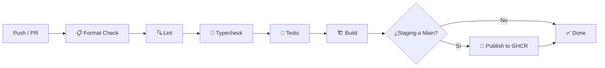

# Integración continua

GitHub Actions verifica los pushes y pull requests dirigidos a `develop`, `staging` y `main`. El pipeline controla formato, lint, tipos, tests y el build de producción.



## Publicación de imágenes

Los pushes a `staging` y `main` publican dos imágenes en **GitHub Container Registry**:

```
ghcr.io/typeitorg/boero-ui:sha-<sha-del-commit>   # Inmutable
ghcr.io/typeitorg/boero-ui:<rama>                  # Puntero a la última imagen exitosa
```

> [!IMPORTANT]
> Los despliegues **deben usar la etiqueta inmutable** `sha-<sha-del-commit>`. La etiqueta de rama es solamente un puntero conveniente.
